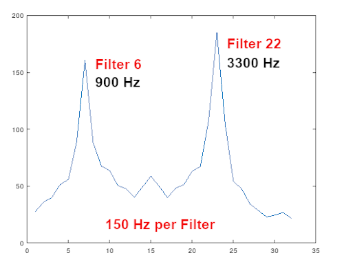

### FSK Modem
An FSK Modem using either 2FSK or 4FSK.

Original program modified to use complex math syntax, and use FFTW real FFT instead of the Kiss FFT.

The demodulator code has been modified to operate on just the real spectrum, as the original worked with the complex spectrum.
#### Build Instructions
First copy the ```libfsk.so``` file to ```/usr/local/lib``` Make sure the permissions are set correctly (644).
```
sudo cp libfsk.so /usr/local/lib
sudo ldconfig
```
Then copy ```fsk.h``` to /usr/local/include
```
sudo cp header/fsk.h /usr/local/include
```
To compile the test file
```
gcc fsk_test.c -o fsk_test -lfsk -lfftw3f -lm
```
Executing the ```fsk_test``` program will create a 2FSK RAW mono audio file ```/tmp/fskdata.raw``` and you can use ```audacity``` to view the spectrum, or play with the audio. It uses a 9600 Hz sample rate at 2400 baud currently.

These are the external library packages needed:
```
NEEDED               libfsk.so
NEEDED               libfftw3f.so.3
NEEDED               libc.so.6
```
#### Examples using Audacity
The audio samples are 16-bit signed PCM, little-endian, 1-Channel. In the test program it uses a 9600 sample rate, with an F1 frequency of 900 Hz, a shift frequency of 2400 Hz, and a symbol rate of 2400 Baud. These are just picked at random.

In 2FSK this results in a 0-bit producing 900 Hz, and a 1-bit producing 3300 Hz. A 4FSK would results in a 00-bits producing 900 Hz, 01-bits producing 3300 Hz, 10-bits producing 5700 Hz, and 11-bits producing 8100 Hz. Not very practical here, but using a lower baud rate would pack it in better.

Basically, you make a call to ```fsk_nin()``` and it tells you the amount of data to read in and send to the demodulator function. There is a real and a complex version of this function, depending on your data source. Also you can switch to a ```streaming``` or ```burst``` mode, where the ```burst``` mode adjusts the ```fsk_nin``` dynamically.

There are about seven different error codes you can recieve when calling the ```fsk_create``` function. These can be read using the ```fsk_get_error_num()``` library call.
#### Project Development
Currently the modem compiles without error, and the modulator/demodulator seems to work.
#### Sample Run Output
```
--------------------------
Frequency offset: 0.0000
PPM = 166.6770

Frequency 1: 900.00
Frequency 2: 3300.00
1111011001000000010001100000000001001111010001000000100000100011

Good Sync
SNR = 6.80
```
If you run the program with:
```
fsk_test -p | octave -i
```
It will plot the demodulator spectrum in each of the test loops.  

